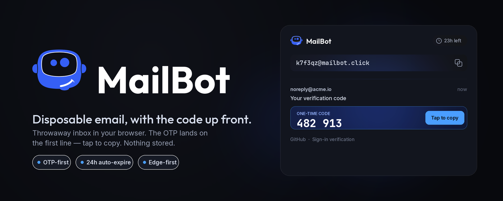

# MailBot

Disposable email, inside Telegram. Press `/start`, get an address, paste it anywhere — every message lands in your chat with the **OTP code on the first line**. Addresses live 24h and expire on their own. Edge-first, nothing stored.

[](https://chromewebstore.google.com/detail/mmjdbaijmhogoepflomfceeppgdbeelb?utm_source=github)
[](https://addons.mozilla.org/firefox/addon/mailbot-disposable-email/?utm_source=github)
[](LICENSE)
[](https://t.me/gotemailbot)
[](https://workers.cloudflare.com/)

**Try it:** [@gotemailbot](https://t.me/gotemailbot) · [mailbot.click](https://mailbot.click) (EN) · [emailbot.ru](https://emailbot.ru) (RU)

## Install

The browser extension is **live on the Chrome Web Store and Firefox Add-ons**; Edge is in review. Links land here as each store approves:

| Browser | Status |
|---------|--------|
| Chrome  | ✅ [**Install from the Chrome Web Store**](https://chromewebstore.google.com/detail/mmjdbaijmhogoepflomfceeppgdbeelb?utm_source=github) |
| Edge    | 🔄 In review — _Edge Add-ons link coming soon_ |
| Firefox | ✅ [**Install from Firefox Add-ons**](https://addons.mozilla.org/firefox/addon/mailbot-disposable-email/?utm_source=github) |

Meanwhile you can use the [Telegram bot](https://t.me/gotemailbot) right now, or build the extension from source (see [Development](#development)).

## Features

- **OTP on the first line** — smart scoring extracts the verification code and puts it first; tap to copy
- **24-hour addresses** — each address expires on its own; create a new one anytime
- **Nothing stored** — mail is parsed at the edge and forwarded to your chat, not kept on our side
- **Email normalization** — strips forwarded headers, invisible junk, logo links; renders `Label <url>` as clickable Telegram links
- **Bilingual** — RU/EN by Telegram locale (UI + email labels)
- **Abuse protection** — per-address and per-user rate limits, sender denylist, size guard
- **Edge-first** — runs entirely on Cloudflare (Email Routing + Workers + D1 + KV), no backend

## How it works

```
email → MX → Cloudflare Email Routing (catch-all) → Worker.email()
      → abuse checks → resolve (localpart, domain) → owner
      → parse MIME → normalize → extract OTP → deliver to Telegram

/start → Worker.fetch() webhook → create address → reply
Cron   → Worker.scheduled() → purge expired addresses
```

The core (`email-core`) is client-agnostic and tied to an **owner** abstraction, not to a Telegram chat — so a future browser-extension client can be added without rewriting the core. See [SPEC.md](SPEC.md) §13.

## Project layout

```
src/            email-core + Telegram client + extension API (Cloudflare Worker)
  index.js        router: email() / fetch() (/webhook, /ingest, /api/*) / scheduled()
  ingest.js       pipeline: parse → normalize → deliver
  normalize.js    body cleanup + link tokenization
  otp.js          scoring OTP extractor
  boxes.js        addresses (gen/collision/limits/provision)
  owners.js       owners + telemetry
  messages.js     stored inbox events (for extension client, TTL)
  delivery.js     deliver(owner, msg) seam — telegram | extension/account
  api.js          /api/* for the browser extension (device-token auth)
  render.js       Telegram message builder
  strings.js      i18n (ru/en)
  push.js         Web Push (RFC 8291/8292) — wakes the extension SW
test/           node:test suites
extension/      browser extension (WXT, Chrome/Edge + Firefox) — popup/side-panel inbox
schema.sql      D1 schema (owners + boxes + messages)
SPEC.md         technical specification
```

## Clients

Two clients sit on one client-agnostic **email-core** (owner abstraction + `deliver(owner,msg)` seam):

- **Telegram bot** ([@gotemailbot](https://t.me/gotemailbot)) — delivers to chat, **stores nothing**.
- **Browser extension** (`extension/`, WXT) — popup/side-panel inbox with OTP detection. Anonymous device-token auth; incoming events are stored server-side in D1 (text only, 24h TTL). Real-time delivery via **Web Push** (Chrome/Edge) with an alarm-poll fallback (Firefox). **Live on the Chrome Web Store and Firefox Add-ons**; Edge in review — see [Install](#install).

## Development

```bash
git clone https://github.com/investblog/mailbot.git
cd mailbot

# Worker (email-core + bot + extension API)
npm install
npm test          # node --test (otp/normalize/render/ratelimit/boxes/delivery/push/strings)
npm run lint      # ESLint
npm run check     # lint + test + wrangler dry-run

# Browser extension (WXT)
cd extension
npm install
npm run check     # typecheck + lint + build (chrome + firefox)
npm run zip:all   # packaged zips for the stores
```

Deploy/infrastructure (D1/KV, Email Routing, secrets) is described in [SPEC.md](SPEC.md) and `wrangler.jsonc`. Releases are built and packaged by CI on a `v*` tag (see `.github/workflows/release.yml`).

## Tech stack

- **Cloudflare Workers** — `email()` + `fetch()` + `scheduled()`, `nodejs_compat`
- **D1** (SQLite) — owners + addresses · **KV** — rate-limit/denylist · **Cron** — cleanup
- **[PostalMime](https://github.com/postalsys/postal-mime)** — MIME parsing · `HTMLRewriter` — HTML→text
- **Web Push** — RFC 8291 (aes128gcm) + RFC 8292 (VAPID) on Web Crypto, no deps
- **Extension:** [WXT](https://wxt.dev) (Chrome/Edge MV3 + Firefox MV2), vanilla TS
- Telegram Bot API over plain `fetch()` — no SMTP, no external services

## Privacy

**Telegram bot:** emails are **not stored** — parsed at Cloudflare's edge and delivered to your chat, where they live with you.

**Browser extension:** since it must display the inbox itself, incoming emails are stored server-side (Cloudflare D1) as **normalized text only** (no raw MIME, no attachments), with a **24h TTL** matching the address lifetime, then auto-purged. Auth is an anonymous device-token (no account, no email/password); the server keeps only its hash.

Either way, addresses are temporary by design and expire after 24h — a throwaway address for catching one-time codes, not for important mail.

## License

[MIT](LICENSE)

---

Built by [301.st](https://301.st) with [Claude](https://claude.ai)
